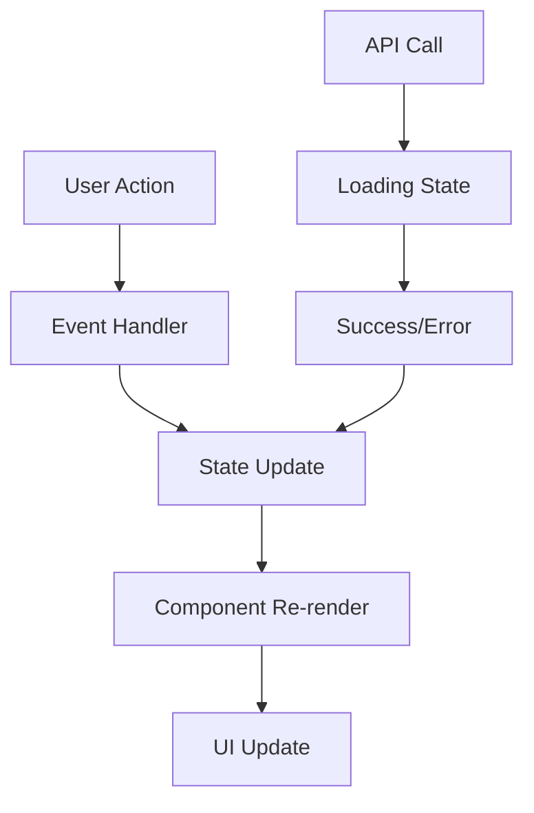
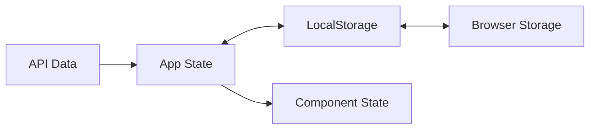

# System Patterns - Flashcard Learning App

## Architecture Overview

### Frontend Architecture (React + TypeScript)
```
src/
├── components/          # UI Components
│   ├── Flashcard/      # Card display logic
│   ├── StudyMode/      # Learning interface
│   ├── ManagementMode/ # CRUD interface
│   └── common/         # Shared components
├── hooks/              # Custom React hooks
│   ├── useLocalStorage # Data persistence
│   ├── useKeyboard     # Keyboard shortcuts
│   ├── useDictionary   # API integration
│   └── useSpeech       # Text-to-speech
├── services/           # External integrations
│   ├── dictionaryApi   # Free Dictionary API
│   ├── geminiApi       # Gemini fallback
│   └── storage         # LocalStorage utils
├── types/              # TypeScript definitions
├── utils/              # Helper functions
└── App.tsx             # Main application
```

## Design Patterns

### 1. State Management Pattern
**Pattern**: Centralized state với useReducer + Context
**Rationale**: Đơn giản hơn Redux nhưng scalable hơn useState

```typescript
// State pattern
interface AppState {
  cards: FlashcardData[];
  currentIndex: number;
  mode: 'study' | 'management';
  isFlipped: boolean;
}

// Action pattern
type AppAction = 
  | { type: 'ADD_CARD'; payload: FlashcardData }
  | { type: 'FLIP_CARD' }
  | { type: 'NEXT_CARD' };
```

### 2. Custom Hooks Pattern
**Pattern**: Logic tách biệt khỏi UI components
**Benefits**: Reusability, testing, separation of concerns

```typescript
// Data persistence
const useFlashcards = () => {
  const [cards, setCards] = useLocalStorage('flashcards', []);
  const addCard = (card) => { /* logic */ };
  return { cards, addCard, updateCard, deleteCard };
};

// External API
const useDictionary = (word: string) => {
  const [data, setData] = useState(null);
  const [loading, setLoading] = useState(false);
  // API logic
  return { data, loading, error };
};
```

### 3. Component Composition Pattern
**Pattern**: Compound components cho flexibility

```typescript
// Instead of monolithic component
<Flashcard>
  <Flashcard.Front>{word}</Flashcard.Front>
  <Flashcard.Back>
    <Flashcard.Meaning>{meaning}</Flashcard.Meaning>
    <Flashcard.Pronunciation>{ipa}</Flashcard.Pronunciation>
    <Flashcard.Notes>{personalNotes}</Flashcard.Notes>
  </Flashcard.Back>
</Flashcard>
```

### 4. Error Boundary Pattern
**Pattern**: Graceful error handling
**Implementation**: React Error Boundaries + fallback UI

```typescript
// API calls always wrapped in try-catch
// User-friendly error messages
// Fallback options (Gemini when Dictionary fails)
```

## Data Flow Architecture

### Unidirectional Data Flow


### Local Storage Integration


## Component Architecture

### Container vs Presentational Pattern
```typescript
// Container (smart component)
export const StudyModeContainer = () => {
  const { cards, currentIndex, nextCard } = useFlashcards();
  const { handleKeyPress } = useKeyboard();
  
  return (
    <StudyModePresentation
      card={cards[currentIndex]}
      onNext={nextCard}
      onKeyPress={handleKeyPress}
    />
  );
};

// Presentation (dumb component)
export const StudyModePresentation = ({ card, onNext }) => {
  return <div>{/* Pure UI logic */}</div>;
};
```

### Higher-Order Component (HOC) Pattern
```typescript
// Keyboard shortcuts wrapper
export const withKeyboardShortcuts = (Component) => {
  return (props) => {
    useKeyboard({
      ' ': props.onFlip,
      'ArrowLeft': props.onPrevious,
      'ArrowRight': props.onNext,
    });
    
    return <Component {...props} />;
  };
};
```

## Integration Patterns

### API Integration Strategy
```typescript
// Fallback pattern for API calls
async function fetchWordData(word: string): Promise<WordData> {
  try {
    // Primary: Free Dictionary API
    return await dictionaryApi.fetch(word);
  } catch (error) {
    try {
      // Fallback: Gemini API
      return await geminiApi.fetch(word);
    } catch (fallbackError) {
      // Final fallback: Basic structure
      return createBasicWordData(word);
    }
  }
}
```

### Storage Pattern
```typescript
// Abstract storage interface
interface StorageService {
  get<T>(key: string): T | null;
  set<T>(key: string, value: T): void;
  remove(key: string): void;
}

// LocalStorage implementation
class LocalStorageService implements StorageService {
  // Implementation with error handling
}

// Future: Could add CloudStorageService, IndexedDBService
```

## Performance Patterns

### Lazy Loading Pattern
```typescript
// Route-based code splitting
const StudyMode = lazy(() => import('./components/StudyMode'));
const ManagementMode = lazy(() => import('./components/ManagementMode'));

// Component lazy loading
const HeavyComponent = lazy(() => import('./HeavyComponent'));
```

### Memoization Pattern
```typescript
// Expensive calculations
const processedCards = useMemo(() => {
  return cards.map(card => processCard(card));
}, [cards]);

// Prevent unnecessary re-renders
const FlashcardMemo = memo(Flashcard);
```

### Debouncing Pattern
```typescript
// Search/API calls
const debouncedSearch = useCallback(
  debounce((query: string) => {
    searchDictionary(query);
  }, 300),
  []
);
```

## Mobile-First Patterns

### Touch Gesture Pattern
```typescript
// Touch events handling
const useTouchGestures = () => {
  const [touchStart, setTouchStart] = useState(0);
  
  const handleTouchStart = (e) => {
    setTouchStart(e.touches[0].clientX);
  };
  
  const handleTouchEnd = (e) => {
    const touchEnd = e.changedTouches[0].clientX;
    const diff = touchStart - touchEnd;
    
    if (diff > 50) onNext(); // Swipe left
    if (diff < -50) onPrevious(); // Swipe right
  };
  
  return { handleTouchStart, handleTouchEnd };
};
```

### Responsive Design Pattern
```typescript
// Hook for responsive behavior
const useResponsive = () => {
  const [isMobile, setIsMobile] = useState(false);
  
  useEffect(() => {
    const checkDevice = () => {
      setIsMobile(window.innerWidth < 768);
    };
    
    checkDevice();
    window.addEventListener('resize', checkDevice);
    return () => window.removeEventListener('resize', checkDevice);
  }, []);
  
  return { isMobile };
};
```

## Security Patterns

### API Key Management
```typescript
// Environment variables for sensitive data
const GEMINI_API_KEY = import.meta.env.VITE_GEMINI_API_KEY;

// Input validation
const validateWord = (word: string): boolean => {
  return /^[a-zA-Z\s-']+$/.test(word) && word.length <= 50;
};

// XSS prevention
const sanitizeInput = (input: string): string => {
  return DOMPurify.sanitize(input);
};
```

## Testing Patterns

### Testing Strategy
```typescript
// Unit tests for hooks
test('useFlashcards should add card', () => {
  const { result } = renderHook(() => useFlashcards());
  act(() => {
    result.current.addCard(mockCard);
  });
  expect(result.current.cards).toContain(mockCard);
});

// Integration tests for API
test('dictionary API integration', async () => {
  const result = await fetchWordData('test');
  expect(result).toHaveProperty('meanings');
});

// E2E tests for user flows
test('complete flashcard study flow', () => {
  // Cypress/Playwright tests
});
```

Các patterns này đảm bảo code maintainable, scalable và performant cho ứng dụng flashcard. 